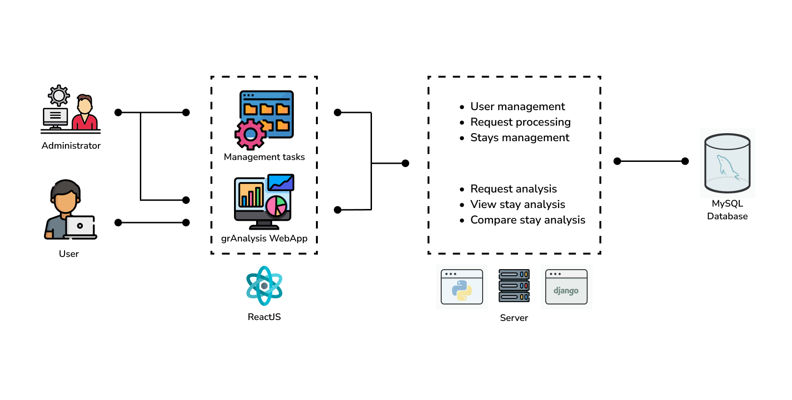

# grAnalysis
Final Degree Project of Computer Engineering Science degree titled "Web application for the study and analysis of customer comments in the hotel sector" at University of Cádiz - 2024
## Abstract
This project focuses on the development of a web platform in which users will be able to request and compare studies based on accommodation reviews registered in Booking. In this way, the user is granted access to relevant information about the reviews of these accommodations, as well as the results of a sentiment analysis of customer comments and different types of statistical studies.

All this will be carried out through a waterfall methodology through which a system will be formed that will consist of a backend server, composed of a REST API; a module that contemplates the collection, analysis and comparison of information; an SQL database, to store all the information captured and analyzed; and a web interface, through which users will access it.

This project's main objective is to automate the process of analyzing the information corresponding to the reviews of the requested accommodations. Thus making it easier for the platform user, through natural language processing, to draw significant conclusions about the opinion that customers have of the accommodations studied.

## Architecture Diagram

## License
GNU General Public License v3.0 - Copyright (c) 2024 - Pablo Granados
